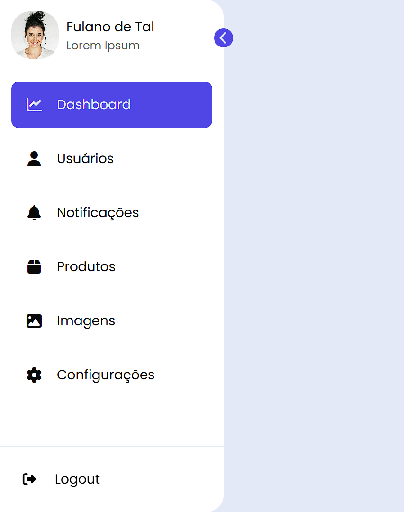

# 📌 Sidebar Interativo

Sidebar responsivo e recolhível desenvolvido para sistemas web modernos. Ideal para painéis administrativos com navegação limpa e intuitiva.



## 🚀 Demo

👉 [Visualizar projeto](https://devpedroluiz.github.io/sidebar/)

## ✨ Funcionalidades

- Sidebar recolhível com animação suave
- Navegação entre seções: Dashboard, Usuários, Notificações, Produtos, Imagens e Configurações
- Perfil do usuário no topo com avatar
- Botão de Logout na parte inferior
- Layout responsivo e adaptável
- Design limpo com tema claro

## 🛠️ Tecnologias

- **HTML5** — estrutura semântica
- **CSS3** — estilização e animações
- **JavaScript** — interatividade e toggle do sidebar
- **Font Awesome 6** — ícones

## 📁 Estrutura

```
sidebar/
├── .github/
│   └── workflows/
│       ├── jekyll-gh-pages.yml
│       └── static.yml
├── src/
│   ├── css/
│   │   └── styles.css
│   └── images/
│       └── avatar.jpg
├── javascript/
│   └── script.js
├── README.md
├── index.html
└── preview.png
```

## 🖥️ Como usar

1. Clone o repositório:
```bash
git clone https://github.com/DevPedroLuiz/sidebar.git
```

2. Abra o arquivo `index.html` no navegador — sem necessidade de instalar dependências.

## 📸 Preview

Clique na seta lateral para recolher/expandir o sidebar e navegar entre as seções.

## 👤 Autor

**Pedro Luiz**

- GitHub: [@DevPedroLuiz](https://github.com/DevPedroLuiz)
- LinkedIn: [Pedro Luiz](https://www.linkedin.com/in/pedro-luiz-2a74621a3/)
- Portfólio: [portfolio-ivory-five-26.vercel.app](https://portfolio-ivory-five-26.vercel.app)

## 📄 Licença

Este projeto está sob a licença MIT. Veja o arquivo [LICENSE](LICENSE) para mais detalhes.
